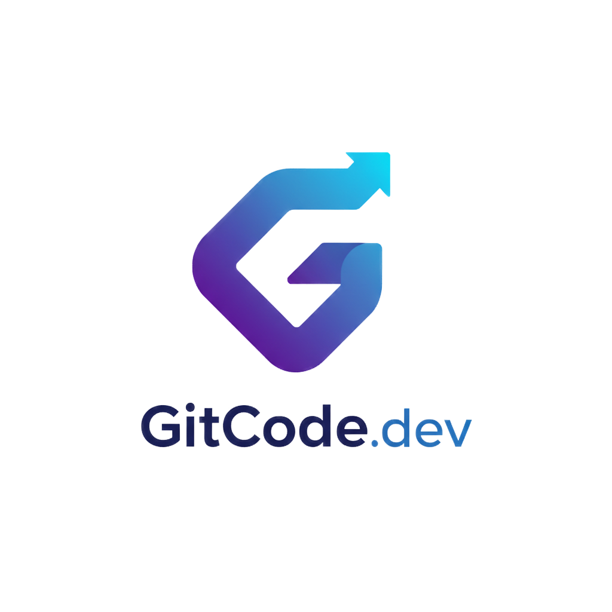
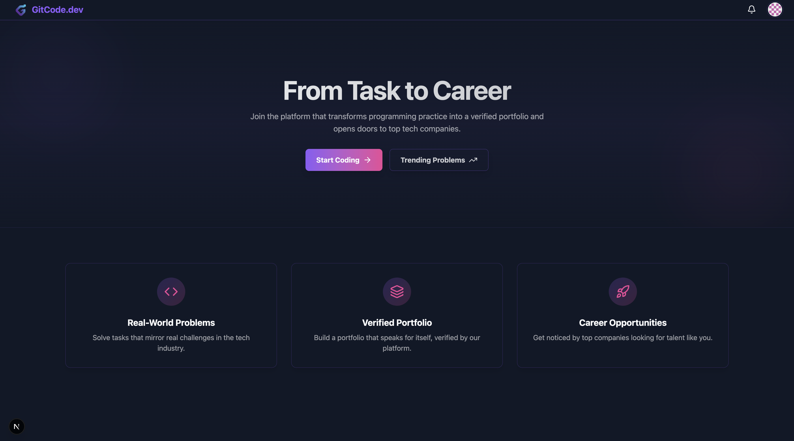

<p align="center">
  
</p>

# GitCode.dev — Solve, Commit, Grow

         

> **"A platform that turns coding challenges into your real GitHub portfolio."**
>
> GitCode.dev is a modern educational ecosystem designed for developers to bridge the gap between learning algorithms and building a professional presence. Every accepted solution is automatically synced to your GitHub repository, creating a verifiable track record of your skills backed by AI-powered mentorship.

<p align="center">  </p>

---

## 📌 Table of Contents

- [🧩 Overview](#-overview)
- [🚀 Getting Started](#-getting-started)
- [🏗️ Architecture & Microservices](#️-architecture--microservices)
- [⚙️ Tech Stack](#️-tech-stack)
- [🧱 Project Goals](#-project-goals)
- [📸 Screenshots](#-screenshots)
- [🧾 License](#-license)
- [💬 Authors](#-authors)

## 🧩 Overview

**GitCode.dev** is an educational platform for developers that combines algorithmic problem-solving with automatic GitHub portfolio building and AI assistance.  
The platform allows users to solve programming challenges directly in the browser, automatically publish accepted solutions to their GitHub repository, and receive feedback from an integrated AI mentor.

---

## 🚀 Getting Started

To run GitCode.dev locally, follow these steps:

1. **Clone the Repository**
   ```bash
   git clone https://github.com/JakubPawinski/GitCode.dev
   ```
2. **Navigate to the Project Directory**
   ```bash
   cd GitCode.dev
   ```
3. **Install Dependencies**
   ```bash
   npm install
   ```
4. **Set Up Environment Variables**  
   Create a `.env` file in the root directory and configure the necessary environment variables (see `.env.example` for reference).
5. **Run the Application**
   ```bash
   npm run dev
   ```
6. **Access the Application**  
   Open your browser and navigate to `http://localhost:3000` to start using GitCode.dev.

---

## 🏗️ Architecture & Microservices

GitCode.dev is built using a **microservices architecture**, organized as an **Nx Monorepo**. Each service is containerized and responsible for a specific domain.

| Service                  | Description                                                                      |                 Documentation                 |
| :----------------------- | :------------------------------------------------------------------------------- | :-------------------------------------------: |
| **API Gateway**          | Entry point for all client requests (routing, rate limiting). Built with Traefik |     [README](apps/api-gateway/README.md)      |
| **Auth Service**         | Manages user sessions and integration with Keycloak/GitHub.                      |     [README](apps/auth-service/README.md)     |
| **Problem Service**      | Manages coding tasks, test cases, and difficulty levels.                         |   [README](apps/problem-service/README.md)    |
| **AI Service**           | Python-based service for code analysis, feedback, and hints.                     |      [README](apps/ai-service/README.md)      |
| **GitHub Service**       | Responsible for committing and pushing solutions to users' repos.                |    [README](apps/github-service/README.md)    |
| **Notification Service** | Handles real-time alerts and email notifications.                                | [README](apps/notification-service/README.md) |
| **Swagger API Docs**     | Auto-generated API documentation for backend services.                           |     [README](apps/swagger-docs/README.md)     |
| **Shared Libraries**     | Common utilities, types, and interfaces.                                         |         [README](packages/README.md)          |
| **Frontend**             | Next.js application for user interface and interaction.                          |         [README](apps/frontend/README.md)          |

[↑ Back to Top](#gitcodedev--solve-commit-grow)

---

## ⚙️ Tech Stack

### Frontend & Designer

- **Framework:** Next.js 16+ (App Router), React, Tailwind CSS
- **Editor:** Monaco Editor (VS Code core)

### Backend & Core

- **Microservices:** Node.js (NestJS) & Python (FastAPI/Alembic) for AI service
- **API Gateway:** Traefik
- **Database:** PostgreSQL
- **ORM:** Prisma & SQLAlchemy

### Infrastructure & DevOps

- **Monorepo Tooling:** [Nx](https://nx.dev/)
- **Authentication:** Keycloak (OIDC) & GitHub OAuth
- **Containerization:** Docker & Docker Compose
- **CI/CD:** GitHub Actions

[↑ Back to Top](#gitcodedev--solve-commit-grow)

## 🧱 Project Goals

- Bridge the gap between **learning** and **career growth**.
- Create a **verifiable GitHub portfolio** through real code challenges.
- Integrate **AI mentorship** into everyday coding practice.
- Provide an extendable architecture for future research and development.

[↑ Back to Top](#gitcodedev--solve-commit-grow)

## 📸 Screenshots

[↑ Back to Top](#gitcodedev--solve-commit-grow)

## 🧾 License

MIT License — freely available for educational and research use.

---

## 💬 Authors

**GitCode.dev Team** — developed as part of a Bachelor’s Degree project in Computer Science.  
Contributions, feedback, and ideas for improvement are always welcome!

---

[↑ Back to Top](#gitcodedev--solve-commit-grow)
